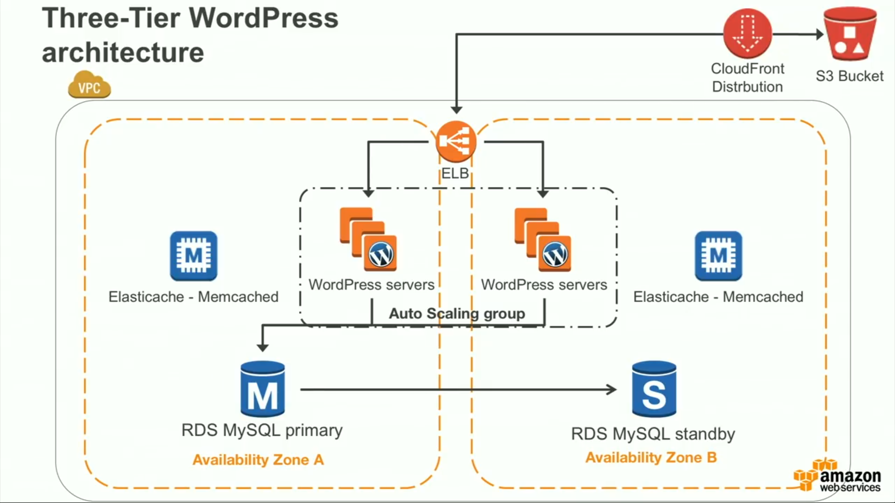

  
  

# Getting Start with AWS

## Overview

1. Elastic Cloud Computing (EC2) - a server which run software on it.
2. Virtual Private Cloud(VPC) - create network in the cloud, run the server in that network
3. Simple Storage Service(S3) -upload and share file
4. Relation Database Service(RDS)- allow to run and manage dbs (sql,mysql)
5. Route53 -DNS ,scale according to demand
6. Elastic Load Balancing(ELB) - load balance incoming trafffic to multiple machine, can get scale up to web application to any no. of user
7. Autoscaling-  never down due to load

## AWS Global Infracture
12 Regions

33 Availability Zones

54 Edge locations

 Each region have 2 AZ.
 Region are defined by geographic area.
 AZ one or more data center, geographically close each other. so they're set to low latency.
Edge location are point of presence where we have our DNS and content delivery services.

## Some drawbacks
1. single point of failure (server failed, software failed then app is down) 
2. not scalable (without downtime) 

## Social Proof

✍️ Show that you shared your process on Twitter or LinkedIn

https://twitter.com/hanminmyat8/status/1299756310863335424
