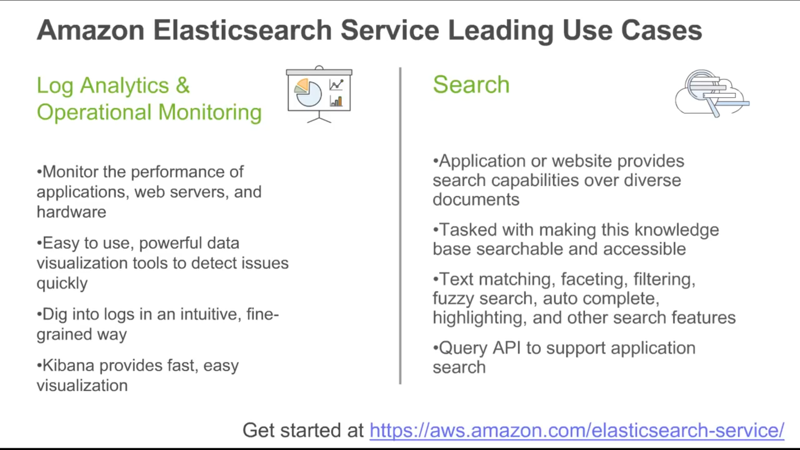
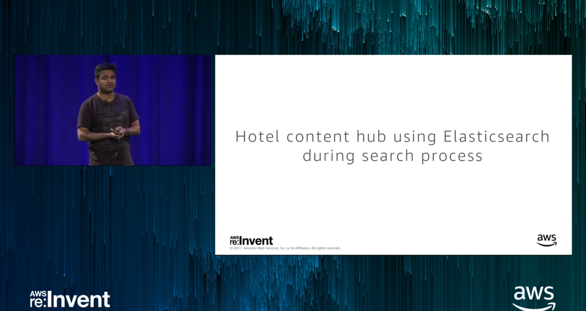
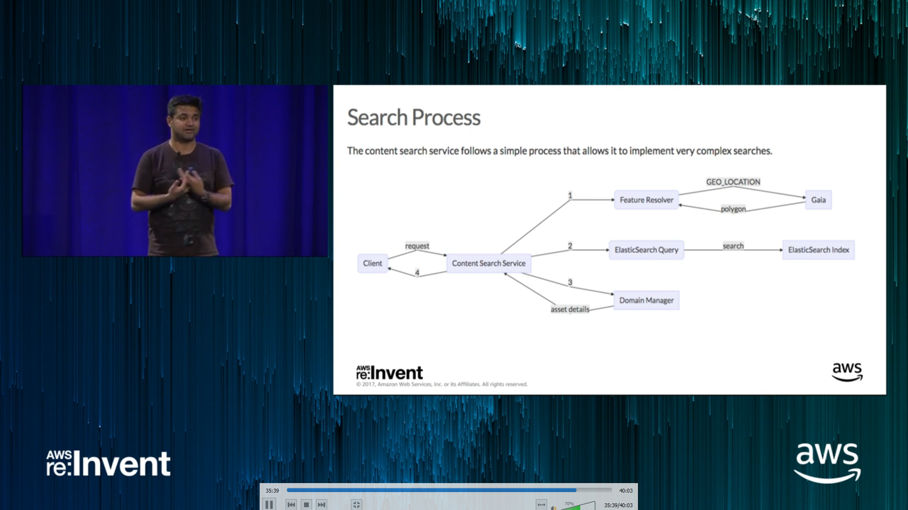

  
  

# Amazon Elastic Search Service

## Introduction
Today I learned Amazon Elastic Search Service from AWS Educate Program. 
 It is a managed service that makes it easy to deploy, operate, and scale Elasticsearch clusters in the AWS Cloud
- first  create a domain. An Amazon ES domain is synonymous with an Elasticsearch cluster. 
- Domains are clusters with the settings, instance types, instance counts, and storage resources that you specify. 
- Each instance acts as one Elasticsearch node.

## Steps

Step 1: Creating an Amazon ES Domain

Step 2: Uploading Data for Indexing

Step 3: Searching Documents in an Amazon ES Domain

Step 4: Deleting an Amazon ES Domain

## Ref

https://docs.aws.amazon.com/elasticsearch-service/latest/developerguide/what-is-amazon-elasticsearch-service.html

## Social Proof

✍️ Show that you shared your process on Twitter or LinkedIn

https://twitter.com/hanminmyat8/status/1300115329310367745
