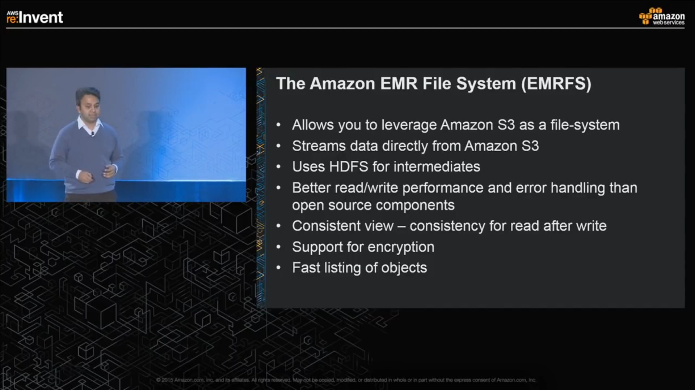

Today I read the two topics about Amazon Elastic MapReduce(EMR) and Amazon Kinesis.

EMR is a cloud big data platform for processing vast amounts of data using open source tools such as Apache Spark, Apache Hive,etc.

Amazon Kinesis is to collect, process, and analyze real-time, streaming data.

# Amazon EMR

To build a cluster
1. Choose Instances
2. Choose Software(Quick Bundle or Custom)

Note: In Hadoop cluster, compute and storage are tightly couple.
So, Compute and Storage grow together.

 Problems : need to duplicate the cluster to prevent size loss? And Replication Adds to cost.
 Solution: Decouple Storage and Compute

## Topics in EMR : Spot Integration
Amazon EMR Integration
You can run Amazon EMR clusters on Spot Instances and significantly reduce the cost of processing vast amounts of data on managed Hadoop clusters. You can run your EMR clusters by easily mixing Spot Instances with On-Demand and Reserved Instances using the instance fleet feature.

  
  <em> price in normal 10 node cluster running 14hr</em>

   
   <em> if we increase the compute power with spot instances</em>

  
  <em> and run it in 7hr</em>

  
  <em> we can reduce 50% run-time and 25% cost</em>

## Elastic MapReduce File System

# Amazon Kinesis
4 services
1. Kinesis Video Streams
2. Kinesis Data Streams
3. Kinesis Data Firehose
4. Kinesis Data Analytics

## Social Proof

✍️ Show that you shared your process on Twitter or LinkedIn

https://twitter.com/hanminmyat8/status/1300467251879931904
